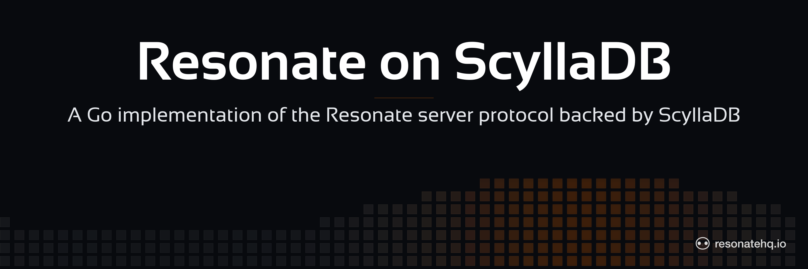

<p align="center">
  <picture>
    <source media="(prefers-color-scheme: dark)" srcset="./assets/banner-dark.png">
    <source media="(prefers-color-scheme: light)" srcset="./assets/banner-light.png">
    
  </picture>
</p>

# Resonate on ScyllaDB

[](https://github.com/resonatehq/resonate-on-scylladb/actions/workflows/ci.yml)
[](./LICENSE)

## About this component

A Go implementation of the [Resonate](https://resonatehq.io) server protocol backed by [ScyllaDB](https://www.scylladb.com/). It speaks the same HTTP/JSON protocol as the core Resonate server, so your application code and your SDK stay as they are — you point `RESONATE_URL` at this instead.

Reach for it when you already run ScyllaDB and would rather not stand up a second database for durable execution. If you don't already run ScyllaDB, run the core server on Postgres — it is the reference implementation and the default recommendation.

This repository is source-available under BUSL-1.1, not Apache-2.0. Development, testing, and evaluation are free; production use needs a commercial license until the Change Date. See [License](#license).

- [Read the docs for this provider](https://docs.resonatehq.io/deploy/providers/scylladb)
- [Evaluate Resonate for your next project](https://docs.resonatehq.io/evaluate/)
- [Example application library](https://github.com/resonatehq-examples)
- [Distributed Async Await — the concepts that power Resonate](https://www.distributed-async-await.io/)
- [Join the Discord](https://resonatehq.io/discord)
- [Subscribe to the Journal](https://journal.resonatehq.io/subscribe)
- [Follow on X](https://x.com/resonatehqio)
- [Follow on LinkedIn](https://www.linkedin.com/company/resonatehqio)
- [Subscribe on YouTube](https://www.youtube.com/@resonatehqio)

## Requirements

- A ScyllaDB cluster reachable over CQL
- Docker and Docker Compose for the local stack below
- Go 1.25.4+ to build from source

## Run

```sh
docker compose --profile server up
```

The server listens on `:8001`. ScyllaDB schema is applied automatically on startup.

The profile is not optional. The `server` service in `docker-compose.yaml` declares `profiles: [server]`, so a bare `docker compose up` starts ScyllaDB and nothing else.

## Connecting workers

This provider is drop-in. It serves the same HTTP/JSON protocol as the core server, so every Resonate SDK reaches it the same way and no client wiring changes:

```sh
RESONATE_URL=http://localhost:8001
```

Your workflow code doesn't change either. If you are moving off the core server, the URL is the whole migration.

The protocol version is `2026-04-01`. The server exposes three routes: `POST /` for protocol requests, `GET /poll/{group}/{id}` for long-poll delivery, and `GET /health`.

## Configuration

`resonate serve` accepts configuration from, in priority order:

1. CLI flags
2. Environment variables
3. Optional config file (`resonate.yaml`)
4. Built-in defaults

### Config file

```sh
resonate serve                        # loads ./resonate.yaml if present
resonate serve --config ./my.yaml     # explicit file; error if missing
```

Example `resonate.yaml`:

```yaml
server:
  addr: ":8001"
  debug: false

scylladb:
  hosts:
    - localhost
  port: 0
  username: ""
  password: ""
  keyspace: ""
  replication: ""
  tls:
    enabled: false
    insecure: false

timeouts:
  bucket-width: 1h
  bucket-lookback: 1
  shards: 1

worker:
  ttl: 15s
  tick-interval: 1s
```

### Environment variables

| Variable | Description |
|---|---|
| `SERVER_ADDR` | Server listen address |
| `SERVER_DEBUG` | Debug mode |
| `SCYLLADB_HOSTS` | Comma-separated seed hosts |
| `SCYLLADB_PORT` | CQL port |
| `SCYLLADB_USERNAME` | Username |
| `SCYLLADB_PASSWORD` | Password |
| `SCYLLADB_TLS_ENABLED` | Enable TLS |
| `SCYLLADB_TLS_INSECURE` | Skip certificate verification |
| `SCYLLADB_KEYSPACE` | Keyspace name |
| `SCYLLADB_REPLICATION` | Replication clause for schema creation |
| `TIMEOUTS_BUCKET_WIDTH` | Timeout bucket width (e.g. `1h`, `30m`) |
| `TIMEOUTS_BUCKET_LOOKBACK` | Past buckets to scan |
| `TIMEOUTS_SHARDS` | Shard count |
| `WORKER_TTL` | Worker row TTL (e.g. `15s`) |
| `WORKER_TICK_INTERVAL` | Coordinator tick interval (e.g. `1s`) |

Two of these will hurt you if you set them casually.

**`SERVER_DEBUG` drops the keyspace.** In debug mode the server issues `DROP KEYSPACE IF EXISTS` and recreates it on every connect. That is why the bundled local stack comes up with a working schema, and why a local restart starts from empty. Pointing a debug-mode server at a populated keyspace destroys it. Debug mode is for local development and the test suites.

**`TIMEOUTS_SHARDS` is baked into the partition key.** The shard is a hash of the record id, stored in the partition key of every timeout row. Every instance must use the same value. Changing it on a populated cluster strands existing rows in partitions no server scans, and durable timers stop firing without an error.

Outside debug mode the server applies no DDL at all — it opens a keyspace-bound session and assumes the schema is there. For any real deployment you provision the keyspace yourself, with a replication strategy you chose deliberately.

## How it's tested

Three suites, all runnable from a clone under Docker Compose.

```sh
# Diff tests — every step checked against an in-memory oracle
docker compose -f docker-compose.test.yml -p resonate-diff --profile diff up --build --abort-on-container-exit --exit-code-from tester-diff; docker compose -p resonate-diff down

# Kill tests — crash mid-transaction, assert invariants on what survives
docker compose -f docker-compose.test.yml -p resonate-kill --profile kill up --build --abort-on-container-exit --exit-code-from tester-kill; docker compose -p resonate-kill down

# Linearizability — concurrent interleavings, model-checked
docker compose -f docker-compose.test.yml -p resonate-linz --profile linearizability up --build --abort-on-container-exit --exit-code-from tester-linearizability; docker compose -p resonate-linz down
```

The kill tests abort an operation at every cooperative yield checkpoint — reads, cursor scans, non-transactional pre-inserts, lightweight-transaction commits, rollbacks, cleanups, batches — a thousand iterations by default, and check named state invariants on what is left. Linearizability is checked with the [Porcupine](https://github.com/anishathalye/porcupine) model checker against the same oracle the diff tests use.

## What's not there yet

Read this before you plan a production rollout.

- **No production reference deployments.** Nobody is running this in production yet.
- **Search is unimplemented.** `task.search` returns `501`. `promise.search` and `schedule.search` aren't recognized kinds at all, so they come back as `400` with `unknown kind: <kind>` rather than `501` — worth knowing if you plan to probe for capability. Anything that queries promises by tag will not work.
- **No authentication.** An auth hook exists in the code, but nothing wires it up and its check is an unimplemented stub, so every request that reaches the server is served. Put it behind your own network controls.
- **Behavior under database-layer failure is an open question.** A repair path exists in the code but is not wired into the running server, so a lost node or a partition is not something the current tests characterize.
- **Known bug:** deleting a schedule can leave stale rows in `schedule_timeouts`.
- **The schema is not settled.** This is a young repository. Check open pull requests before you build tooling against the column layout.

## Community

- [Discord](https://resonatehq.io/discord)
- [X](https://x.com/resonatehqio)
- [LinkedIn](https://www.linkedin.com/company/resonatehqio)
- [YouTube](https://www.youtube.com/@resonatehqio)
- [Journal](https://journal.resonatehq.io)

## License

`resonate-on-scylladb` is licensed under the [Business Source License 1.1](LICENSE) (BUSL-1.1).

This is **not** an open-source license. Non-production use (development, testing, evaluation) is permitted. **Any production use requires a commercial license from Resonate HQ, Inc.** On the Change Date (2030-07-01), each released version converts to the Apache License, Version 2.0.

For commercial licensing, contact licensing@resonatehq.io.
